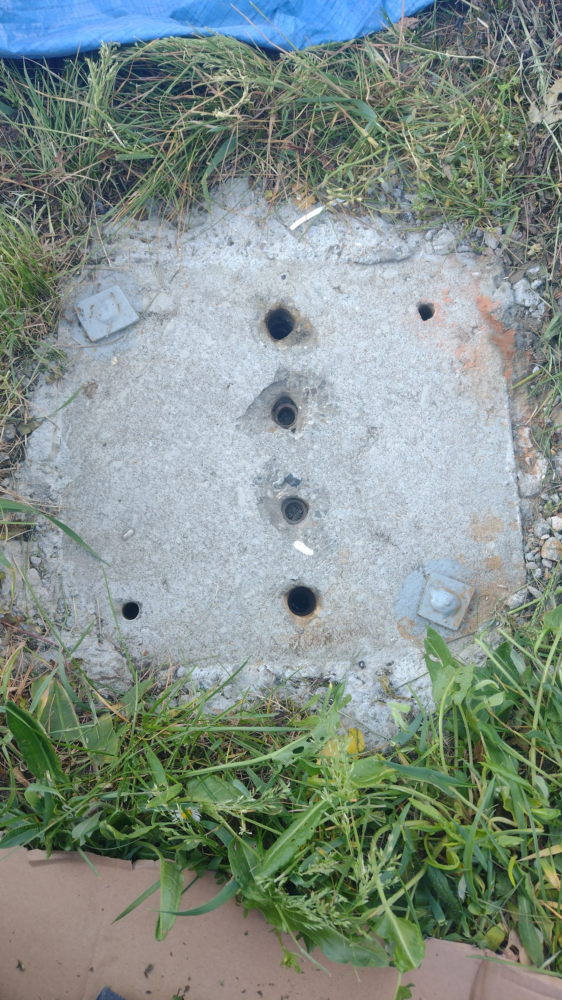

# Offgrid Photovoltaic Management System 
 ### Project contains:
 #### Power and mechanical part:
 - [PV panels connection and DIY Ground Mount structure](#pv-panels-connection-and-diy-ground-mount-structure) 

 - Installation and wiring of the EASUN inverter
#### Managemenet system part:
- [BMS for lead-acid batteries](#bms-for-lead-acid-batteries) - equalize battery, protect from large charge/discharge currents, montors battery state (temp, voltage)
- [ESP32 Master module](#esp32-master-module) - it communicate with EASUN  converter, BMS, Homa Assistant, Energy Meters and sensor. Supervise all system work propertly.
- [Home Assistant integration](#home-assistant-integration) - integrate ESP Master module with HA for easy and compact managment (local and remote access)
- [Power Tracking module](#power-tracking-module) - it is used to regulate heater power accordingly to avaible energy from PV
  

## PV panels connection and DIY Ground Mount structure 
The photovoltaic modules I used in my PV installation are Trina Solar TSM-245. These are used panels that I purchased for around $40 each. The installation consists of 8 modules connected in series.

[📄 **Trina Solar TSM-245 datasheet**](docs/datasheets/TSM-PC05_trinasolar.pdf)

<table>
  <tr>
    <td align="center">
       
      PV module TSM-245 - technical data
    </td>
    <td align="center">
       
      PV module TSM-245 - internal diode wiring
    </td>
  </tr>
</table>

<table>
  <tr>
    <td align="center">
       
      PV module TSM-245 - front
    </td>
    <td align="center">
       
      PV module TSM-245 - back
    </td>
  </tr>
</table>

<table>
  <tr>
    <td align="center">
       
      PV module TSM-245 - front
    </td>
    <td align="center">
       
      PV module TSM-245 - back
    </td>
  </tr>
</table>

<table>
  <tr>
    <td align="center" colspan="2">
       
      Concrete base with reinforcement
    </td>
  </tr>
  <tr>
    <td align="center">
       
      Concrete base with mounting thread
    </td>
    <td align="center">
       
      Concrete base with bitumen
    </td>
  </tr>
</table>

# Management System diagram:

## BMS for lead-acid batteries
BMS have several tasks:
- Battery Balancer equalizes the state of charge of two series connected 12V batteries. If one of battery is overcharged it discharge it using resistor.
- Bidirectional DC-DC converter - protect battery from too much discharge or charge current
- Battery monitoring - measurment of temperature of each battery and voltage.

The BMS is controlled by an AVR64DD28 microcontroller. To program it, you need a programmer that supports UPDI.
I'm using SerialUPDI (a modified version with high-voltage programming capability and galvanic isolation, which you can find here: SerialUPDI link).

To measure battery voltage and current, I use the INA226 sensor along with the built-in ADC of the microcontroller.

The INA226 measures:

- The voltage of the entire battery pack, split into BATT_LOW (bottom battery) and BATT_HIGH (top battery)

- The voltage across a shunt resistor, used to measure the current flowing through the entire pack

Since the INA226 is bidirectional, it allows both charging and discharging current measurements.

The microcontroller’s ADC measures only BATT_LOW voltage.
By subtracting the ADC reading from the INA226’s total voltage reading, I can calculate the BATT_HIGH voltage.

Cell balancing is performed using high-power resistors, each connected in parallel with a battery cell.
Each resistor is switched by a MOSFET, which is controlled by the MCU using PWM.

PWM is hardware-generated using the TCD timer, which controls two outputs: WOA and WOB, each assigned to a specific MCU pin.

The TCD timer is capable of generating...

## ESP32 Master module

## Home Assistant integration

## Power Tracking module
