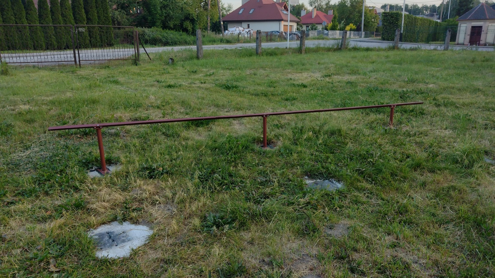

# Offgrid Photovoltaic Management System 
 ### Project contains:
 #### Power and mechanical part:
- PV panels connection and DIY Ground Mount structure

  1.[ Photovoltaic modules](#1-photovoltaic-modules)  
  2.[ Concrete base mounting](#2-concrete-base-mounting)  
  3.[ Metalworking and welding mounting bases and angle bar](#3-metalworking-and-welding-mounting-bases-and-angle-bar)  
  4.[ Painting mounting base, angle bars and perforated profiles](#4-painting-mounting-base-angle-bars-and-perforated-profiles)  
  5.[ PV mountings to perforated profiles](#5-pv-mountings-to-perforated-profiles)  
  6.[ Assembly of PV installation](#6-assembly-of-pv-installation)  
  7.[ Fully assembled PV installation](#7-fully-assembled-pv-installation) 
  8.[ Underground Cable Installation and Connection to the Building](#8-underground-cable-installation-and-connection-to-the-building)
 
 - Installation and wiring of the EASUN inverter
#### Managemenet system part:
- [BMS for lead-acid batteries](#bms-for-lead-acid-batteries) - equalize battery, protect from large charge/discharge currents, montors battery state (temp, voltage)
- [ESP32 Master module](#esp32-master-module) - it communicate with EASUN  converter, BMS, Homa Assistant, Energy Meters and sensor. Supervise all system work propertly.
- [Home Assistant integration](#home-assistant-integration) - integrate ESP Master module with HA for easy and compact managment (local and remote access)
- [Power Tracking module](#power-tracking-module) - it is used to regulate heater power accordingly to avaible energy from PV
  

## PV panels connection and DIY Ground Mount structure 

### 1. Photovoltaic modules
The photovoltaic modules I used in my PV installation are Trina Solar TSM-245. These are used panels that I purchased for around $40 each. The installation consists of 8 modules connected in series.

[📄 **Trina Solar TSM-245 datasheet**](docs/datasheets/TSM-PC05_trinasolar.pdf)

<table>
  <tr>
    <td align="center">
       
      PV module TSM-245 - technical data
    </td>
    <td align="center">
       
      PV module TSM-245 - internal diode wiring
    </td>
  </tr>
</table>

<table>
  <tr>
    <td align="center">
       
      PV module TSM-245 - front
    </td>
    <td align="center">
       
      PV module TSM-245 - back
    </td>
  </tr>
</table>

The first stage was marking the mounting points for the mouting base structure. The entire construction has eight support points. After digging holes in the ground, they were filled with concrete, and concrete bases with reinforcement were embedded in them. I had plenty of these as production waste from the company where I work. They are typically used for mounting lightning protection masts on flat building roofs.

Inside each base, there is reinforcement and four M16 threads. I modified the bases by drilling holes on the opposite side, and I welded additional reinforcement to the bottom using scrap metal, which helps to improve the structural stability.

Before mounting the structure to the concrete bases, the contact surfaces were coated with a bituminous compound to prevent corrosion.

### 2. Concrete base mounting

<table>
  <tr>
    <td align="center" colspan="2">
       
      Concrete base with reinforcement
    </td>
  </tr>
  <tr>
    <td align="center">
       
      Concrete base with mounting thread
    </td>
    <td align="center">
       
      Concrete base with bitumen
    </td>
  </tr>
</table>
 

Visible in the photo below is a set of four steel mounting bases of varying heights, with welded pipes and mounting plates. Each element was made with consideration for uneven ground, that is why there are different pipe lengths. Each base has a bottom plate with holes for M16 bolts, intended for anchoring to a concrete base. On the table next to them lies a long steel angle bar, which was welded from several sections. After welding, the elements were ground down. The photo was taken after the mechanical work was completed, during surface preparation for painting. 
All the steel used for building the PV mouting structure comes from scrap yard.

### 3. Metalworking and welding mounting bases and angle bar
 
<table>
  <tr>
    <td align="center" colspan="2">
       
      Metalworking and welding mounting bases and angle bar
    </td>
  </tr>
  <tr>
    <td align="center" colspan="2">
       
      Steel angle bar before painting
    </td>
  </tr>
    <tr>
    <td align="center" colspan="2">
       
      Longer mounting base  while painting
    </td>
  </tr>
</table>

Longer mounting base are responsible for the solar incidence angle which in this case is 40 degrees
### 4. Painting mounting base, angle bars and perforated profiles
<table>
  <tr>
    <td align="center" colspan="2">
      <a href="docs\photos\ground-mount-structure\steel-workshop-and-painting-11.jpg">
        
      

        
        

          Shorter and longer mounting base after painting
        

      

    </td>
  </tr>
  <tr>
    <td colspan="2" style="text-align: left;">
      

        
        

          Shorter mounting base after painting
        

      

    </td>
  </tr>
  <tr>
    <td colspan="2" style="text-align: left;">
      

        
        

          Perforated profiles, often used for fixing cable tray systems, turned out to be ideal as internal panel brackets. Since they are galvanized, they must be painted with zinc-compatible paint.
        

      

    </td>
  </tr>
  <tr>
    <td colspan="2" style="text-align: left;">
      

        
        

          Longer mounting bases drying after painting
        

      

    </td>
  </tr>
</table>

### 5. PV Mountings to perforated profiles

<table>
  <tr>
    <td colspan="2" style="text-align: left;">
      

        
        

          Sheet metal used to prepare panel mounts for perforated profiles
        

      

    </td>
  </tr>

  <tr>
    <td colspan="2" style="text-align: left;">
      

        
        

          Panel mounts for perforated profiles before welding and drilling
        

      

    </td>
  </tr>

  <tr>
    <td colspan="2" style="text-align: left;">
      

        
        

          Panel mounts for perforated profiles. The central M10 bolt is used to attach to the perforated profile, and the two M8 holes are for screwing PV panels
        

      

    </td>
  </tr>

  <tr>
    <td colspan="2" style="text-align: left;">
      

        
        

          Solar panel mounting elements after painting, drying in progress
        

      

    </td>
  </tr>

  <tr>
    <td colspan="2" style="text-align: left;">
      

        
        

          Spacer for mounting solar panels to the perforated panels which are on the outer side of mounting structure
        

      

    </td>
  </tr>

  <tr>
    <td colspan="2" style="text-align: left;">
      

        
        

          Solar panel mounts for perforated profiles – painted and drying
        

      

    </td>
  </tr>

  <tr>
    <td colspan="2" style="text-align: left;">
      

        
        

          Solar panel mounts for perforated profiles
        

      

    </td>
  </tr>
</table>

### 6. Assembly of PV installation
<table>
  <tr>
    <td colspan="2" style="text-align: left;">
      

        
        

          Shorter mounting bases and angle bar mounted on concrete bases. Thanks to the height difference of the mounting bases, the angle bar remains level
        

      

    </td>
  </tr>
  <tr>
    <td colspan="2" style="text-align: left;">
      

        
        

          Shorter mounting base mounted on a concrete base. Before installation, the base was coated with a bituminous compound. Stainless steel bolts were used for assembly
        

      

    </td>
  </tr>
  <tr>
    <td colspan="2" style="text-align: left;">
      

        
        

          Ground mounting structure ready for PV panel installation
        

      

    </td>
  </tr>
  <tr>
    <td colspan="2" style="text-align: left;">
      

        
        

          Here you can see how the panel mounts are used to connect solar panel with perforated profile
        

      

    </td>
  </tr>
</table>

### 7. Fully assembled PV installation
<table>
    <tr>
    <td align="center" colspan="2">
       
      Fully assembled PV installation - front
    </td>
  </tr>
    </tr>
    <tr>
    <td align="center" colspan="2">
       
      Fully assembled PV installation - back
    </td>
  </tr>
</table>

### 8. Underground Cable Installation and Connection to the Building
To connect the panels, I used AsXSn 4x35 cable and additionally laid an AsXSn 4x25 cable. I found these cables at a scrapyard at a good price, which is why I chose this somewhat unconventional option. Additionally, I installed a gel-filled Ethernet twisted pair cable to allow for potential data transmission if needed.

<table>
  <tr>
    <td align="center">
       
      

        Underground cable entry to the building
      

    </td>
  </tr>

  <tr>
    <td align="center" valign="top">
       
      

        Cable entry point inside the building
      

    </td>
    <td align="center" valign="top">
       
      

        Close-up of the conduit connection and grounding wire
      

    </td>
  </tr>
</table>

To connect the AROT 50 (blue) protective pipe with the RL50 pipe (white), I created an adapter using a 3D printer. PETG material was chosen for its weather resistance. The opening in adapter was designed to fit the protective pipe only after heating the adapter. Once cooled, the adapter holds the pipe in place.

<table>
</tr>
  </tr>
  <tr>
  <td align="center" colspan="2">
     
    Adapter 3D model   
  </td>
  </tr>

  <tr>
    <td align="center" valign="top">
       
      

        Adapter after printing
      

    </td>
    <td align="center" valign="top">

       
      

        Junction box inside the building. Visible screw terminals for two cables, twisted pair Ethernet connection, and additional grounding.  
      

    </td>
  </tr>
  <tr>
    <td align="center" valign="top" style="width: 420px;">
       
      

        Junction box at the PV installation site.
      

    </td>
  </tr>
</table>

# Management System diagram:

## BMS for lead-acid batteries
BMS have several tasks:
- Battery Balancer equalizes the state of charge of two series connected 12V batteries. If one of battery is overcharged it discharge it using resistor.
- Bidirectional DC-DC converter - protect battery from too much discharge or charge current
- Battery monitoring - measurment of temperature of each battery and voltage.

The BMS is controlled by an AVR64DD28 microcontroller. To program it, you need a programmer that supports UPDI.
I'm using SerialUPDI (a modified version with high-voltage programming capability and galvanic isolation, which you can find here: SerialUPDI link).

To measure battery voltage and current, I use the INA226 sensor along with the built-in ADC of the microcontroller.

The INA226 measures:

- The voltage of the entire battery pack, split into BATT_LOW (bottom battery) and BATT_HIGH (top battery)

- The voltage across a shunt resistor, used to measure the current flowing through the entire pack

Since the INA226 is bidirectional, it allows both charging and discharging current measurements.

The microcontroller’s ADC measures only BATT_LOW voltage.
By subtracting the ADC reading from the INA226’s total voltage reading, I can calculate the BATT_HIGH voltage.

Cell balancing is performed using high-power resistors, each connected in parallel with a battery cell.
Each resistor is switched by a MOSFET, which is controlled by the MCU using PWM.

PWM is hardware-generated using the TCD timer, which controls two outputs: WOA and WOB, each assigned to a specific MCU pin.

The TCD timer is capable of generating...

## ESP32 Master module

## Home Assistant integration

## Power Tracking module
